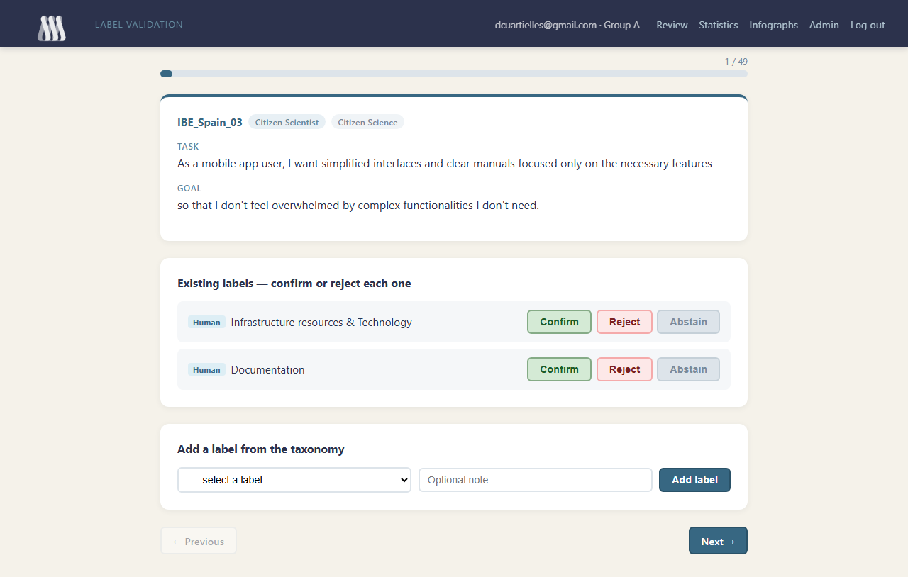
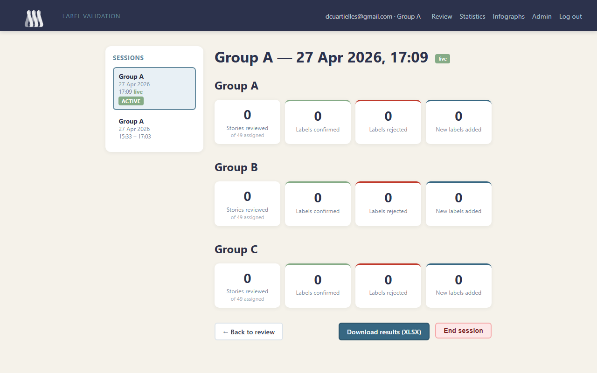
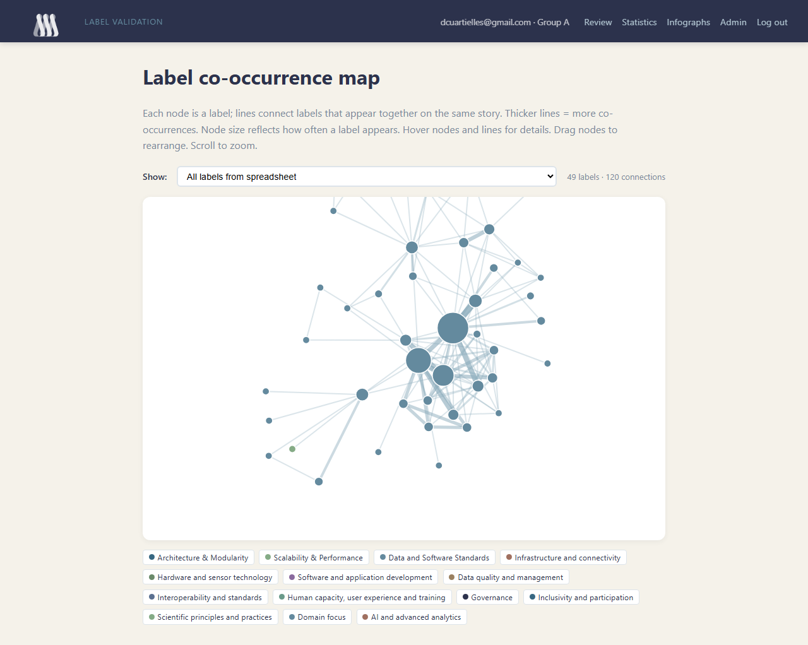
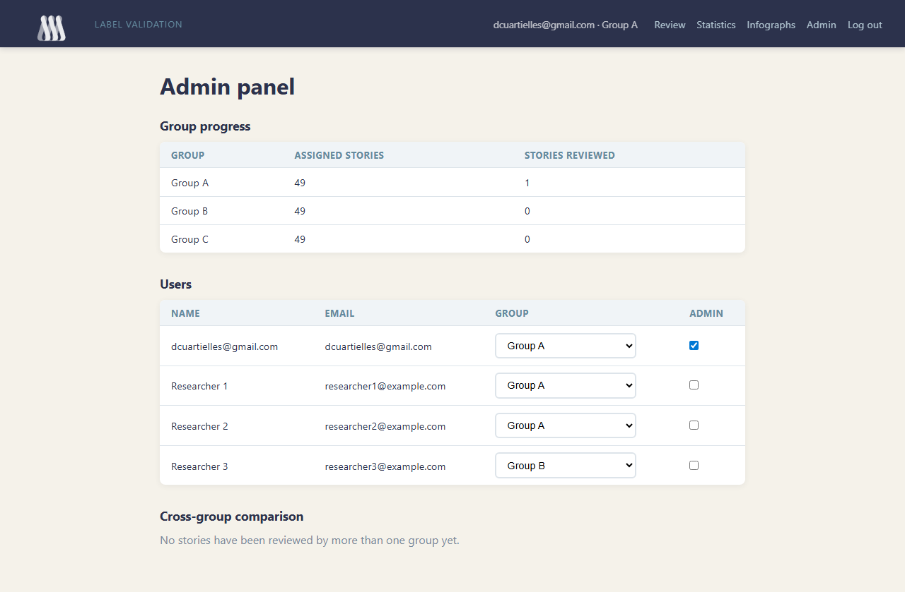

# RIECS Label Validation

A collaborative web application for research groups to validate AI- and human-generated labels on user stories. Designed for use in moderated remote sessions where multiple groups review the same dataset and produce a reconciled, annotated Excel export.

Built for the [RIECS](https://riecs.eu) pan-European citizen science research infrastructure project.

---

## How it works

### 1. Login

Participants sign in with their Google account. No password or account creation required — any Google account can be added to the system by an administrator.


---

### 2. Review stories one by one

After login, researchers are taken straight to the review queue. Stories are shown one at a time, in the order assigned to their group.



Each story card shows:
- **Story ID** and metadata (user type, stakeholder group)
- **Task** and **Goal** fields from the original user story
- **Existing labels** — both Human and AI generated — each with Confirm / Reject / Abstain buttons

**Confirming a label** means the group agrees it belongs to this story.  
**Rejecting** means the group disagrees.  
**Abstaining** records that the group reviewed it but chose not to decide.

Hovering over a label shows its taxonomy description (dashed underline = description available).

Researchers can also **add new labels** from the taxonomy using the dropdown below the existing labels. An optional free-text note can accompany each addition. Labels added in error can be removed before moving on.

Navigation buttons at the bottom step through the queue. The progress bar at the top shows how far through the assigned stories the group has reached.

---

### 3. Track progress in Statistics

The Statistics page shows a live summary of the current session — how many stories have been reviewed, and how many labels were confirmed, rejected, or newly added.



The **session sidebar** on the left lists all past and active sessions for the group. Clicking any session shows its stats in the main area. Each session is timestamped; active sessions are marked **live**, completed ones **ended**.

The **Download results (XLSX)** button exports the full annotated spreadsheet for the selected session. The export mirrors the original input file layout with colour highlights:
- **Yellow** — rows that were reviewed
- **Green** — confirmed labels and new additions
- **Red** — rejected labels

Administrators also see a cross-group overlap count when multiple groups have reviewed the same stories.

The **End session** button closes the current session and preserves its stats for future reference. A new session starts automatically the next time the group opens the review page.

---

### 4. Explore the label co-occurrence map

The Infographs page shows a force-directed network of all labels in the dataset.



- **Nodes** represent labels; size reflects how frequently a label appears across stories
- **Edges** connect labels that appear on the same story; thickness and opacity reflect how many stories share that pair
- **Node colour** indicates the taxonomy top-level category (legend shown below the graph)
- **Hover a node** to see its name, category, and story count
- **Hover an edge** to see which two labels it connects and how many stories they share together
- **Drag nodes** to rearrange; scroll to zoom
- Toggle between **All labels** (from the original spreadsheet) and **Confirmed labels only** using the dropdown

---

### 5. Admin panel

Administrators have access to the Admin panel, where they can:



- See all registered users and assign them to review groups
- Monitor per-group progress (stories reviewed, labels confirmed/rejected/added)
- Inspect cross-group overlap: stories reviewed by more than one group, with a side-by-side breakdown of each group's decisions per label

---

## Getting started

### Requirements

- Python 3.11+
- A Google Cloud project with OAuth 2.0 credentials ([guide](https://developers.google.com/identity/protocols/oauth2))
- An ngrok account (or any HTTPS tunnel / public server) for the OAuth redirect URI

### Installation

```bash
git clone https://github.com/dcuartielles/riecs-label-validation.git
cd riecs-label-validation
python -m venv .venv
source .venv/bin/activate        # Windows: .venv\Scripts\activate
pip install -r requirements.txt
```

### Configuration

Copy `.env.example` to `.env` and fill in your values:

```env
GOOGLE_CLIENT_ID=your-google-client-id
GOOGLE_CLIENT_SECRET=your-google-client-secret
SECRET_KEY=a-long-random-string
DATABASE_URL=sqlite+aiosqlite:///./labelling.db
BASE_URL=https://your-public-domain.ngrok-free.app
```

In your Google Cloud Console, add `https://your-public-domain/auth/google/callback` as an **Authorised redirect URI**.

### Import data

Place your stories spreadsheet in `input_data/` and your taxonomy file in `labelbook/`, then run:

```bash
python -m scripts.import_data
```

Add `--reset` to wipe and reimport from scratch.

### Create the first admin

```bash
python -m scripts.create_admin your@email.com
```

Log in once via Google first so the user record exists.

### Run

```bash
python run.py
```

The app starts on `http://localhost:8000`. Expose it via ngrok:

```bash
ngrok http --domain=your-domain.ngrok-free.app 8000
```

---

## Project structure

```
app/
  routers/       FastAPI route handlers (auth, review, stats, admin, export, infograph)
  templates/     Jinja2 HTML templates
  static/        CSS, JS, images, favicon
  models.py      SQLAlchemy ORM models
  auth.py        Google OAuth setup
  database.py    Async SQLAlchemy engine
scripts/
  import_data.py   Load stories + taxonomy + assign groups
  create_admin.py  Promote a user to admin
labelbook/       Taxonomy spreadsheet
docs/            Screenshots and supplementary materials
```

---

## Tech stack

| Layer | Technology |
|---|---|
| Backend | [FastAPI](https://fastapi.tiangolo.com) + [uvicorn](https://www.uvicorn.org) |
| Database | SQLite via [SQLAlchemy](https://www.sqlalchemy.org) (async / aiosqlite) |
| Auth | Google OAuth 2.0 via [Authlib](https://docs.authlib.org) |
| Templates | [Jinja2](https://jinja.palletsprojects.com) (server-rendered, no JS framework) |
| Export | [openpyxl](https://openpyxl.readthedocs.io) |
| Visualisation | [D3.js](https://d3js.org) v7 (force-directed graph) |

---

## License

This project was developed as part of the RIECS project. Contact the project team for licensing details.
