# RIECS Label of User Stories

A collaborative web application for research groups to classify and validate user stories against a structured taxonomy. Designed for use in moderated, time-boxed workshops where multiple partner institutions review the same dataset in parallel and produce a reconciled, annotated Excel export.

Built for the [RIECS](https://riecs.eu) pan-European citizen science research infrastructure project.

---

## Architecture

The facilitator runs the application on their own machine and exposes it to all participants through an **ngrok tunnel**. No server or cloud infrastructure is required beyond a free ngrok account.

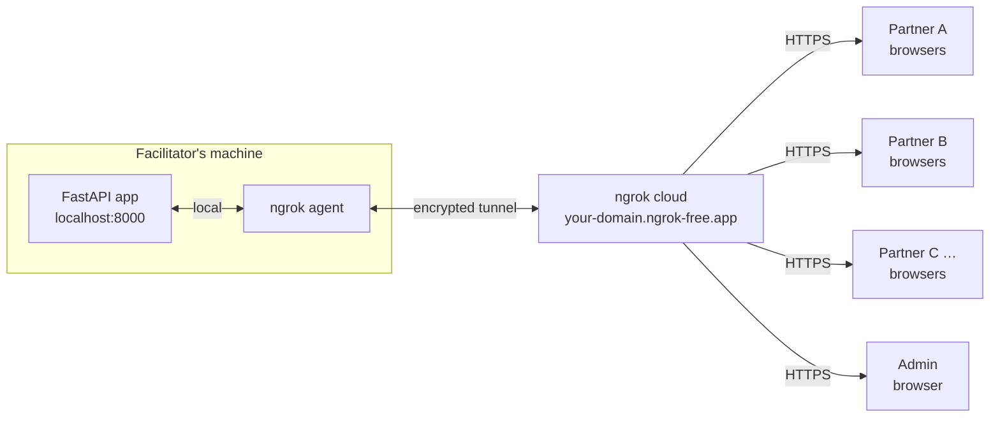

All traffic flows through a single HTTPS endpoint. Participants need only a browser and the shared URL — no installation, no accounts beyond Google login.

---

## How it works

### 1. Login

Participants sign in with their Google account. No password or account creation is required — the admin pre-registers participants by email so their group assignment is already in place when they first log in.


---

### 2. Waiting for the session to start

Before the facilitator opens the session, participants who navigate to the review page see a waiting screen. This prevents any reviewing before the session is officially started.


---

### 3. Review stories one by one

Once the session is started, researchers are taken to the review queue. Stories are shown one at a time in the order assigned to their group.


The page is divided into a **left column** (story content and label creation) and a **right sidebar** (mandatory classifications, label picker, and navigation). Each part is described below.

---

#### Progress bar

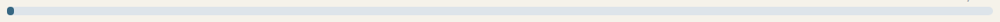

A thin bar spanning the full page width shows how far through the assigned queue the reviewer has reached. The fraction (e.g. *1 / 139*) is shown at the right end. The bar fills left-to-right as stories are completed.

---

#### Story card

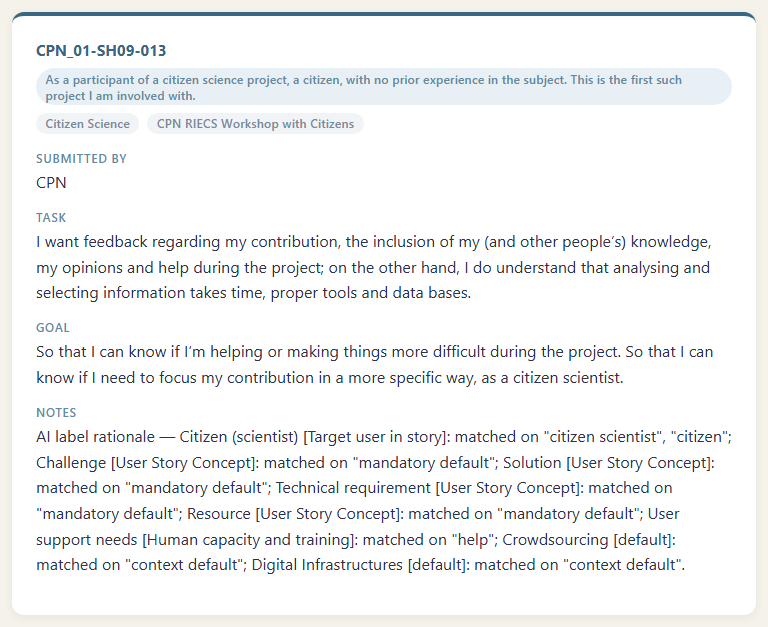

The story card is the primary reading area. It shows:

- **Story ID** — unique identifier linking the story back to the source spreadsheet (e.g. `CPN_01-SH09-013`)
- **User type badge** — the persona or role the story is written from (grey pill at the top)
- **Thematic tags** — stakeholder group and workshop source (muted pills)
- **Submitted by** — the partner institution that contributed the story
- **Task** — what the user wants to accomplish (highlighted teal keywords indicate AI-extracted concepts)
- **Goal** — the motivation or outcome the user expects
- **Notes** — additional context added by the story author; during the simulation this field contains the AI label rationale

---

#### Labels from teammates — confirm or reject

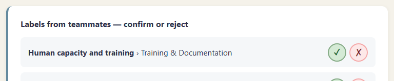

Stories in the **10% overlap set** are assigned to two partner groups. When a story already has labels from a different group, those labels appear here — one row per label. Each row shows the main category, the specific sublabel, and two action buttons:

| Button | Action |
|---|---|
| ✓ (green) | Confirm — you agree this label applies |
| ✗ (red) | Reject — you disagree with this label |

Confirmed and rejected rows are visually highlighted. These decisions populate the *Peer Review Summary* in the infographic Breakdown tab and the *Statistics & Conflicts* sheet in the export.

---

#### Create a new taxonomy label

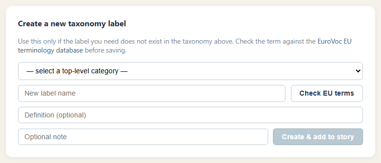

If no existing label fits the story, a new one can be proposed here:

1. **Select a top-level category** from the dropdown — or choose **Other** to name a brand-new category.
2. **Type the new label name** in the text field.
3. Click **Check EU terms** — the system queries the [EuroVoc](https://eurovoc.europa.eu) EU terminology SPARQL endpoint. Matching terms are listed with **use this** buttons that auto-fill the label name and definition. Running the check is mandatory before the submit button becomes active.
4. Optionally fill in a **definition** and an **optional note**.
5. Click **Create & add to story** to save the new label to the taxonomy and attach it to the current story in one step.

Created labels are tracked separately under *My new labels* (visible below the Add a label card once created) and appear with a yellow **new** badge throughout the application.

---

#### Target user in story *(right sidebar — mandatory)*

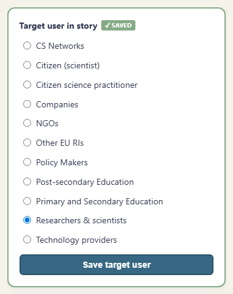

A radio button list covering all defined user-actor categories. Exactly one must be selected before the reviewer can advance. The panel border turns green and the header shows **✓ SAVED** once a selection has been saved. This classification drives the **C02 Target User Distribution** chart.

---

#### User story concepts *(right sidebar — mandatory)*

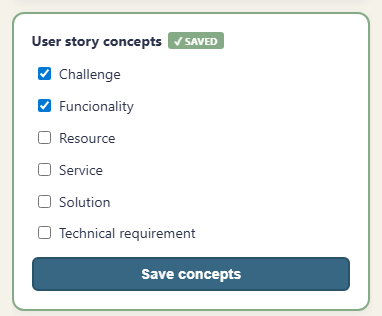

A checkbox list of structural story categories — *Challenge*, *Service*, *Resource*, *Solution*, *Functionality*, *Technical requirement*. One or more must be checked and saved before advancing. The panel border turns green and the header shows **✓ SAVED** once saved. These values drive the **C03 Story Concept Distribution** chart.

---

#### Story assessment *(right sidebar)*

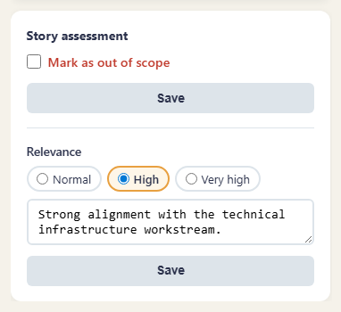

Two optional quality signals that do not affect label counts but are exported separately:

- **Mark as out of scope** — flags the story as not relevant to the workshop's scope. A text area appears to enter a brief reason. Flagged stories appear in the *Rejections & Relevance* export sheet.
- **Relevance** — a three-way radio: *Normal* (default), *High*, *Very high*. Selecting High or Very high reveals a text area for a justification note. High-relevance stories are highlighted in the export.

Each subsection has its own **Save** button.

---

#### Add a label *(right sidebar)*

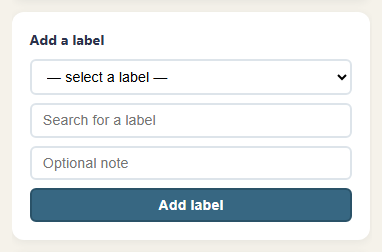

The primary labelling interface. Three controls work together:

- **Dropdown** — hierarchical selector organised by main taxonomy category; choosing an entry from the dropdown pre-fills the search field
- **Search field** — type-ahead free-text search across all sublabel names; selecting a match from the datalist fills the dropdown and shows the label's definition in a blue description box below
- **Optional note** — a short free-text annotation to accompany the label (e.g. explaining why this label applies)

Click **Add label** to attach the selected label to the story. Added labels appear in a *My labels* list directly below the form; each has a ✕ button to remove it before moving on.

---

#### Navigation *(right sidebar)*

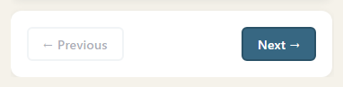

**← Previous** and **Next →** links move through the assigned queue. The **Next** button is highlighted in teal. If the mandatory classifications have not been saved, a warning is shown above the buttons and the Next button displays a caution indicator — the reviewer can still advance but the story will be counted as incomplete in the statistics.

---

### 4. Track progress in Statistics

The Statistics page shows a live summary per partner institution for the active session.


---

#### Session sidebar

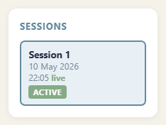

The left sidebar lists all sessions recorded in the database. Each entry shows the session number, start date and time, and a **live** badge for the active session or an **ended** badge for closed ones. Click any entry to switch the main area to that session's data — useful for comparing progress across multiple workshop days.

---

#### Session header

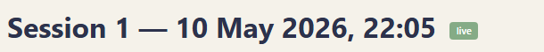

The main area opens with a title showing the session number, start date and time, and a **live** indicator when the session is still open.

---

#### Partner stat cards

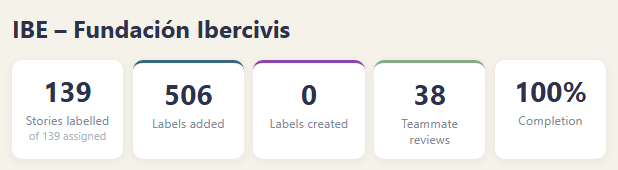

One block of five stat cards appears per partner institution. The cards use distinct border colours so they are visually scannable at a glance:

| Card | Border | Meaning |
|---|---|---|
| Stories labelled | Default | Distinct stories that have at least one label or classification saved, out of the total assigned |
| Labels added | Teal | Labels picked from the existing taxonomy and attached to stories |
| Labels created | Purple | Brand-new taxonomy labels proposed by this group and saved to the database |
| Teammate reviews | Green | Labels from the overlap set confirmed or rejected by this group |
| Completion | Default | Percentage of assigned stories fully processed |

---

#### Cross-group overlap notice

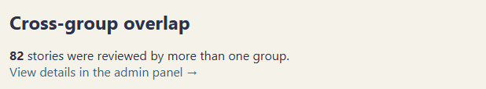

At the bottom of the partner list, a notice reports how many stories were reviewed by more than one group (the overlap set). A link leads directly to the full comparison table in the Admin panel.

---

#### Download buttons

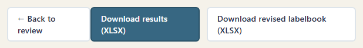

Three buttons are always visible at the foot of the page:

- **← Back to review** — returns to the reviewer's queue
- **Download results (XLSX)** — exports the full results for the selected session: one sheet per partner, plus *Summary*, *Rejections & Relevance*, and *Statistics & Conflicts* sheets
- **Download revised labelbook (XLSX)** — exports the complete taxonomy including any labels proposed during sessions, ready to carry into the next workshop

---

### 5. Browse the labelbook

The Labels page shows the complete taxonomy — both the pre-loaded labelbook and any labels proposed during sessions.


A search box at the top filters the table in real time. User-created labels are sorted to the top and marked with a yellow **new** tag.

---

### 6. Infographic dashboard

The Infographs page aggregates all label assignments into fifteen interactive charts across eight tabs. Charts auto-refresh at the interval configured when the session was started (default 60 s during workshops). A summary line at the top right shows the total number of labels and stories at the last refresh.


---

#### Filtering

Clicking any bar or node in any chart sets a **filter** — an amber bar appears below the tab strip listing the active filter values. All other charts immediately update to show only the subset of stories that match. Multiple filters stack and combine with AND logic. Clicking **Clear all** resets the entire dashboard to the unfiltered view.

Filterable dimensions: partner institution, main taxonomy category, specific sublabel, target user type, and story concept.

---

#### C01/C10 · Frequency

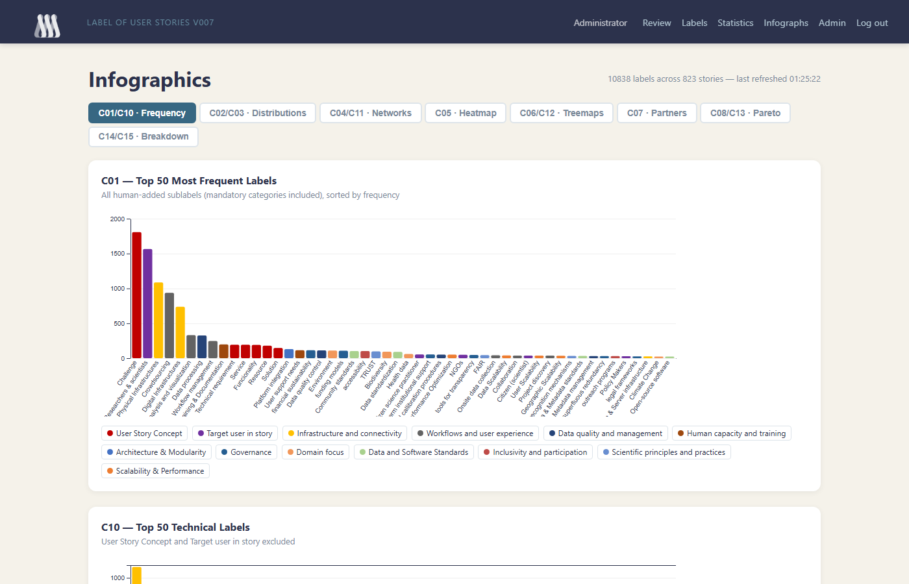

Two vertical bar charts displayed one above the other on the same tab:

- **C01 — Top 50 Most Frequent Labels** includes every label type: technical taxonomy labels plus the mandatory *Target user in story* and *User Story Concept* classifications. This gives the broadest view of what the dataset is about.
- **C10 — Top 50 Technical Labels** excludes the mandatory categories, focusing on the EuroVoc-aligned taxonomy labels only.

Bars are colour-coded by main category; a legend below each chart maps colours to category names. Clicking a bar sets a sublabel filter that propagates to all other tabs.

---

#### C02/C03 · Distributions

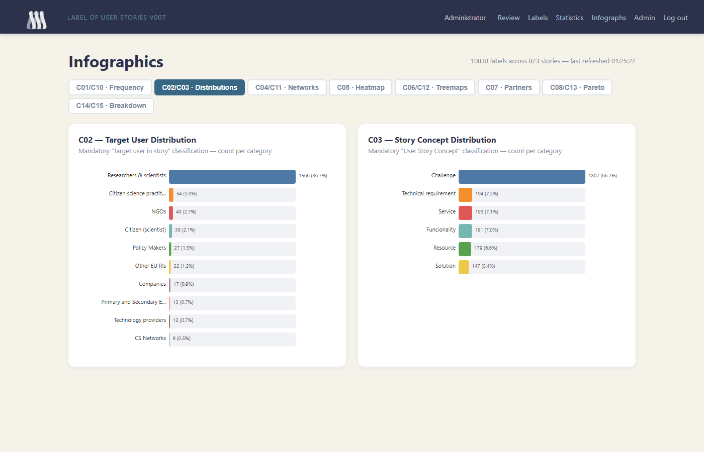

Two horizontal bar charts shown side by side:

- **C02 — Target User Distribution** counts how many stories were assigned each *Target user in story* value (e.g. *Researchers & scientists*, *NGOs*, *Policy Makers*). Each bar shows the raw count and its percentage of the total. Clicking a bar filters all charts to stories with that target user.
- **C03 — Story Concept Distribution** counts how many stories were assigned each *User Story Concept* value (e.g. *Challenge*, *Service*, *Resource*). Same interaction: click to filter.

These two charts directly reflect the mandatory classification step in the review flow.

---

#### C04/C11 · Networks

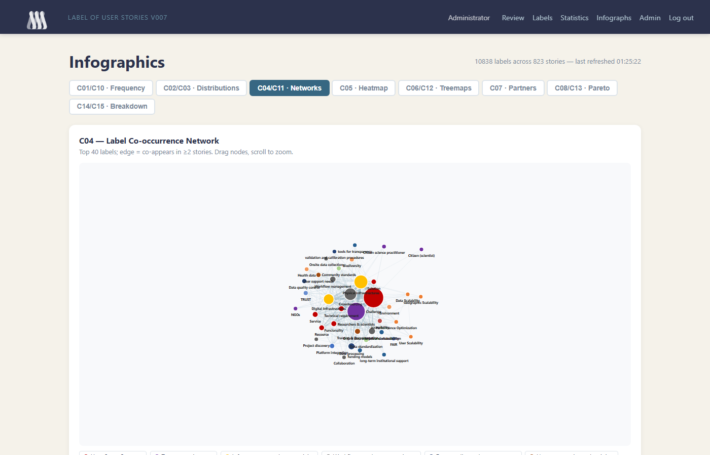

Two force-directed network graphs:

- **C04 — Label Co-occurrence Network** covers all label types. Each node is a label (sized by frequency); each edge connects two labels that appear on the same story (weighted by co-occurrence count). Only the top 40 labels and edges with count ≥ 2 are drawn to keep the graph readable.
- **C11 — Technical Label Co-occurrence Network** applies the same logic but excludes mandatory categories.

Interactions: drag any node to reposition it; scroll to zoom in/out; hover a node for its name, category, and story count; hover an edge for the two connected labels and their co-occurrence count.

---

#### C05 · Heatmap

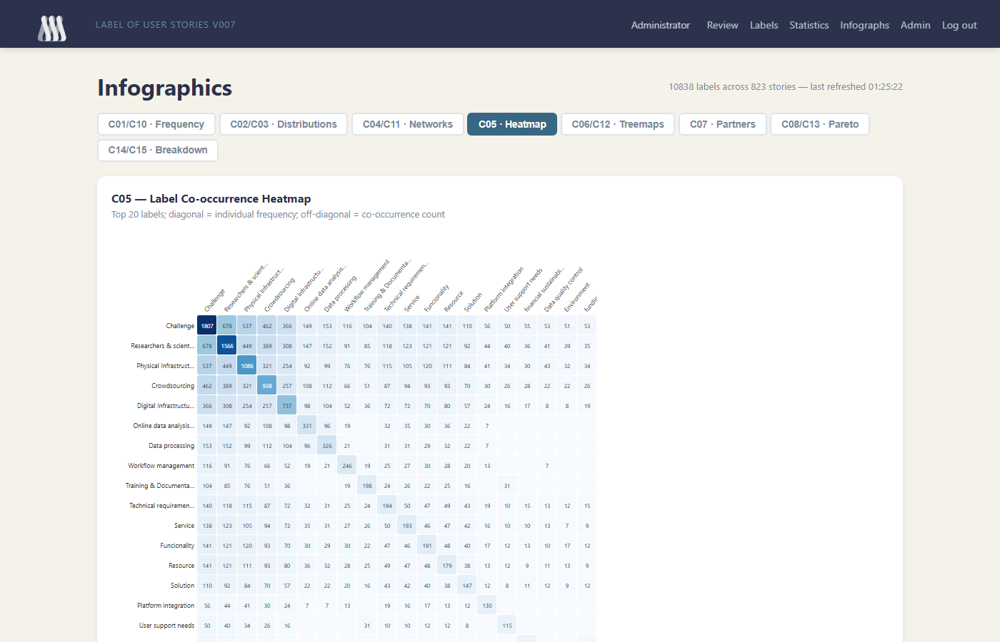

A 20×20 matrix of the top 20 labels. **Diagonal cells** (where row = column) show each label's individual frequency — the darker the blue, the more often it appears. **Off-diagonal cells** show how many stories carry both the row label and the column label simultaneously. Empty cells indicate pairs that never co-occur in the dataset. Label names are truncated with an ellipsis; hover a cell to see the full names and exact count.

---

#### C06/C12 · Treemaps

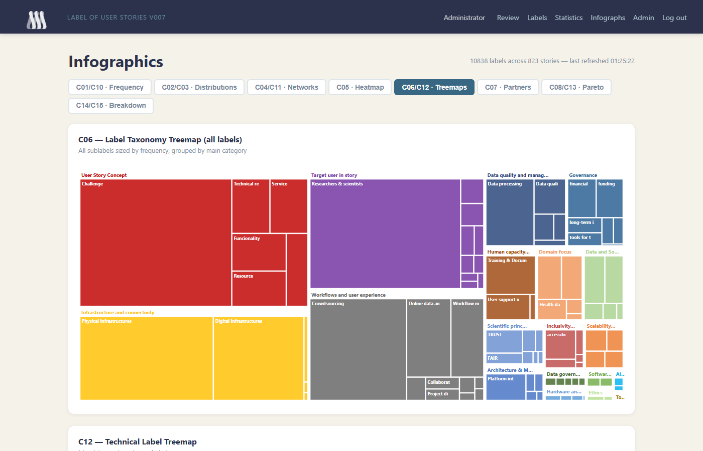

Two treemaps grouped by main taxonomy category:

- **C06 — Label Taxonomy Treemap (all labels)** sizes each tile by frequency and groups tiles into coloured blocks by main category. The mandatory categories (*User Story Concept* in red, *Target user in story* in purple) dominate the left side; technical categories fill the right.
- **C12 — Technical Label Treemap** shows the same structure but with mandatory categories removed, making the relative size of technical categories easier to compare.

Hover any tile for the sublabel name, main category, and count. Click a tile to filter by its main category.

---

#### C07 · Partners

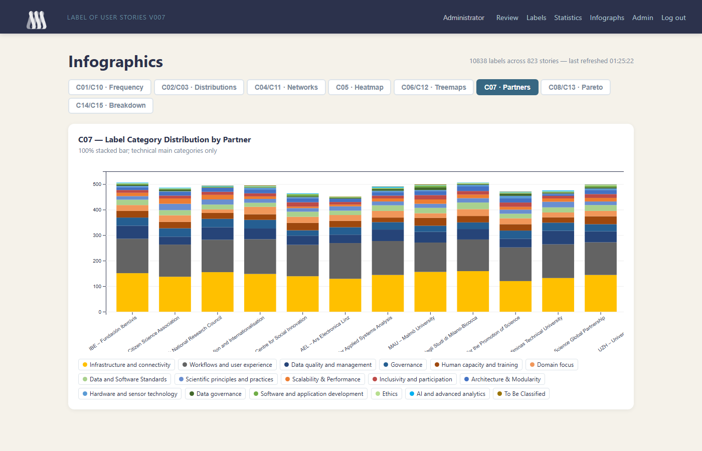

A grouped bar chart showing the absolute count of technical labels per main category for each partner institution. Because different partners review different story subsets (chosen by the seeded random assignment), their distributions legitimately differ — this chart is the primary tool for spotting which partner groups engaged most with which thematic areas. A full legend maps category colours at the bottom.

---

#### C08/C13 · Pareto

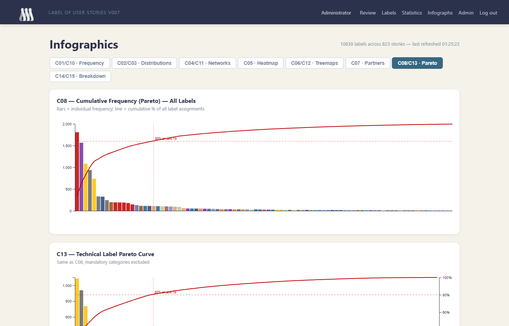

Two Pareto (cumulative frequency) charts displayed one above the other:

- **C08 — Cumulative Frequency (all labels)** — each bar is one label sorted by descending frequency; the red curve shows the running cumulative percentage of all label assignments. A dashed vertical line and annotation mark the point at which 80% of all assignments are accounted for, showing how concentrated labelling activity is.
- **C13 — Technical Label Pareto** — same chart with mandatory categories excluded.

The 80% marker is the key reading: if it falls at rank 10 it means ten labels cover four-fifths of all activity, indicating a highly concentrated dataset. A marker at rank 30+ indicates a more evenly spread taxonomy usage.

---

#### C14/C15 · Breakdown

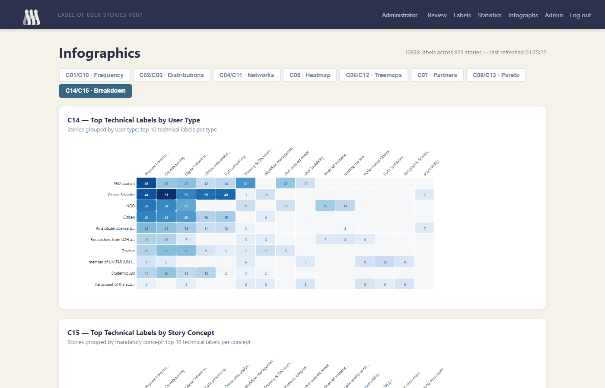

Two cross-tabulation matrices that combine mandatory classifications with technical labels:

- **C14 — Top Technical Labels by User Type** — rows are distinct *Target user in story* values; columns are the top 10 technical labels across the whole dataset; each cell shows the count of stories that carry both that user type and that technical label. Darker cells indicate stronger associations between a user type and a technical domain.
- **C15 — Top Technical Labels by Story Concept** — same structure, with rows showing *User Story Concept* values instead of user types.

A **Peer Review Summary** section below the matrices shows the total number of teammate label decisions that were confirmed vs. rejected, providing a quick quality signal for the overlap set.

---

### 7. Admin panel

Administrators have access to the Admin panel, which controls sessions, users, and cross-group analysis.


---

#### Session control

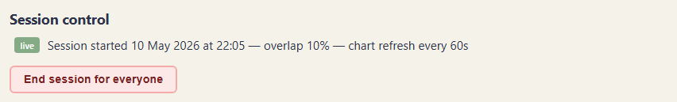

When a session is live, this section shows the session start time, the configured overlap percentage, and the chart refresh interval. A single **End session for everyone** button closes the session — participants immediately see the waiting screen and can no longer submit labels.

When no session is active, the section shows a form with two configuration fields:
- **Overlap %** (slider, default 10%) — the fraction of stories assigned to every group simultaneously. These shared stories feed the cross-group comparison and conflict detection.
- **Chart refresh interval** (seconds, minimum 60) — how often the infographic auto-refreshes during the workshop. Lower values give more real-time feedback; higher values reduce server load in large groups.

Clicking **Start session** generates story assignments for all groups using a deterministic seeded random shuffle (seed shared with the simulation script so results are reproducible) and opens the review queue for everyone.

---

#### Group progress

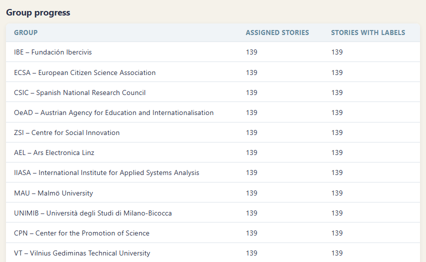

A table listing every partner group with two columns: **Assigned stories** (total stories in their queue for the current session) and **Stories with labels** (stories where at least one label or classification has been saved). This gives the facilitator a real-time view of which groups are ahead or behind during the workshop, without needing to switch between partner views on the Statistics page.

---

#### Users

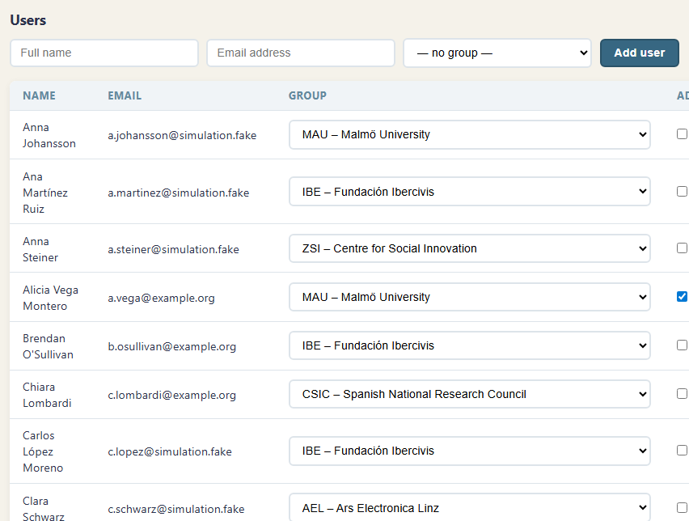

The top row of the section is an **Add user** form: full name, email address, group assignment (dropdown), and an **Add user** button. Submitting this form pre-registers a participant — when they sign in with Google for the first time, their group is already in place.

Below the form, the **user table** lists every registered user with:
- **Name** and **Email**
- **Group** — a live dropdown; changing the selection immediately reassigns the user without a separate save step
- **Admin** checkbox — tick to grant admin privileges; changes take effect on the user's next page load
- **Remove** button — deletes the user record; their label decisions remain in the database

---

#### Cross-group overlap

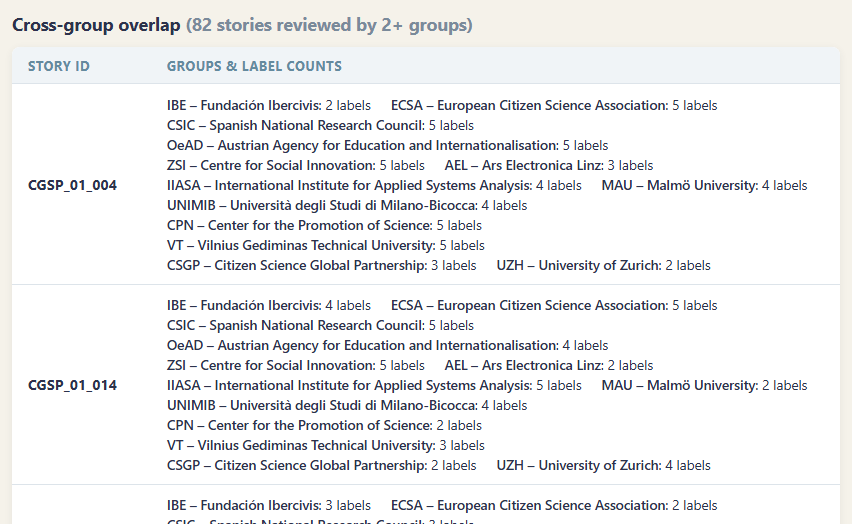

For every story in the overlap set that has been labelled by two or more groups, a table row lists the **Story ID** alongside each group's label count. This is the primary tool for post-session conflict review: stories where groups assigned very different numbers of labels, or labelled the same story with contradictory technical categories, are immediately visible. The full detail (which specific labels each group chose) is available in the *Statistics & Conflicts* sheet of the XLSX export.

---

## Getting started

### Requirements

- Python 3.11+
- A Google Cloud project with OAuth 2.0 credentials ([guide](https://developers.google.com/identity/protocols/oauth2))
- An [ngrok](https://ngrok.com) account (free tier is sufficient) with a static domain

### Installation

```bash
git clone https://github.com/dcuartielles/riecs-label-validation.git
cd riecs-label-validation
python -m venv .venv
source .venv/bin/activate        # Windows: .venv\Scripts\activate
pip install -r requirements.txt
```

### Configuration

Create a `.env` file in the project root:

```env
GOOGLE_CLIENT_ID=your-google-client-id
GOOGLE_CLIENT_SECRET=your-google-client-secret
SECRET_KEY=a-long-random-string
DATABASE_URL=sqlite+aiosqlite:///./labelling.db
BASE_URL=https://your-domain.ngrok-free.app
```

In your Google Cloud Console, add `https://your-domain.ngrok-free.app/auth/google/callback` as an **Authorised redirect URI**.

### Import data

Place the stories spreadsheet in `input_data/` and the taxonomy file in `labelbook/`, then run:

```bash
python -m scripts.import_data
```

The script auto-detects the highest-versioned file in `input_data/`.

| Command | Effect |
|---|---|
| `python -m scripts.import_data` | Import if the database is empty; skip if data already exists |
| `python -m scripts.import_data --reset` | Wipe stories, groups, and decisions; keep labels proposed during sessions |
| `python -m scripts.import_data --reset --reset-labels` | Wipe everything including all taxonomy labels — use when replacing the labelbook entirely |

### Create the first admin

```bash
python -m scripts.create_admin your@email.com
```

This can be run before the first login — the account is linked to your Google identity when you sign in. If the account already exists in the database it is promoted to admin.

### Pre-register participants

Log in as admin, open the **Admin panel**, and use the **Add user** form to enter each participant's name, email, and group. They will land in the correct group the moment they log in.

### Run the application

```bash
python run.py
```

The app starts on `http://localhost:8000`. In a second terminal, expose it via ngrok:

```bash
ngrok http --domain=your-domain.ngrok-free.app 8000
```

Share the ngrok URL with participants. Start the session from the Admin panel when everyone is ready.

---

## Facilitator checklist

- [ ] Import data (`python -m scripts.import_data`)
- [ ] Create admin account (`python -m scripts.create_admin your@email.com`)
- [ ] Start the app (`python run.py`) and the ngrok tunnel
- [ ] Pre-register participants in the Admin panel
- [ ] Share the ngrok URL
- [ ] Click **Start session** when ready to begin
- [ ] Monitor progress on the Admin and Stats pages
- [ ] Click **End session** when time is up
- [ ] Download results from the Stats page

---

## Scripts reference

All scripts live in `scripts/` and are run from the project root.

| Script | Purpose | Key flags |
|---|---|---|
| `scripts/import_data.py` | Load stories and taxonomy from spreadsheets into the database | `--reset`, `--reset-labels` |
| `scripts/create_admin.py` | Create a user record or promote an existing one to admin | *(email as positional arg)* |
| `scripts/simulate_session.py` | Run a deterministic workshop simulation for testing and screenshots | `--save-users`, `--mask-users`, `--phase 1`, `--phase 2`, `--peer-reviews`, `--status`, `--reset` |

### `scripts/import_data.py` — Load source data

Reads stories from the spreadsheet in `input_data/` and the taxonomy from `labelbook/`, then populates the database.

```bash
python -m scripts.import_data                          # import if DB is empty
python -m scripts.import_data --reset                  # clear stories + decisions, keep labels
python -m scripts.import_data --reset --reset-labels   # clear everything
```

The `--reset` flag is safe to use between workshops — it does not remove labels that participants proposed during a session.

---

### `scripts/create_admin.py` — Create or promote an admin

Creates a user record for the given email (or promotes an existing one) to admin.

```bash
python -m scripts.create_admin your@email.com
```

Run this once before the first login. The record is linked to your Google account on first sign-in.

---

### `scripts/simulate_session.py` — Workshop simulation

Simulates a complete labelling session for testing and screenshot generation. Uses deterministic random seeds so results are reproducible. See `docs/evaluation-procedure.md` for the full step-by-step procedure.

#### Phase overview

| Command | What it does |
|---|---|
| `--save-users` | Back up real user names/emails to `scripts/real_users_backup.json` |
| `--mask-users` | Replace real user names/emails with realistic fake identities for screenshots |
| `--phase 1` | Insert 39 fake users (3 per partner), create a session, label ~50% of stories |
| `--peer-reviews` | Add peer-review decisions for ~5% of labelled stories per group |
| `--phase 2` | Label the remaining ~50% of stories |
| `--status` | Print a summary of current DB state |
| `--reset` | Delete all session data, remove fake users, restore real users from backup |

#### Typical workflow

```bash
# 1. Back up real users (run once before any simulation)
python scripts/simulate_session.py --save-users

# 2. Optionally mask real identities for screenshots
python scripts/simulate_session.py --mask-users

# 3. Phase 1 — creates session + ~50% labels
python scripts/simulate_session.py --phase 1

# 4. Add peer reviews for phase-1 labels
python scripts/simulate_session.py --peer-reviews

# 5. Take screenshots at this point (50% coverage)

# 6. Phase 2 — complete remaining ~50%
python scripts/simulate_session.py --phase 2

# 7. Add peer reviews for phase-2 labels
python scripts/simulate_session.py --peer-reviews

# 8. Take final screenshots; download export from /export

# 9. Reset — restore real users, wipe simulation data
python scripts/simulate_session.py --reset
```

#### What the simulation generates

- **39 fake users** — 3 per partner institution, with `@simulation.fake` email addresses so they can always be identified and removed
- **1 session** — 10% story overlap, 60 s chart refresh
- **~6 320 label records** from keyword analysis of story text (task, goal, notes)
- **~1 807 mandatory classifications** (target user + story concepts)
- **~113 story rejections** and **~55 relevance flags**
- **~459 peer-review decisions** (80% confirm / 20% reject)

#### Changing the seed

The label selection uses `SIM_RNG_SEED = 777` at the top of `simulate_session.py`. Changing this value produces a different label distribution while keeping the story assignment order identical (which is governed by the separate `RANDOM_SEED = 42`, shared with the admin panel).

---

## Project structure

```
app/
  routers/
    auth.py         Google OAuth login / logout
    review.py       Story review, mandatory classifications, EuroVoc lookup
    stats.py        Session statistics and XLSX export
    admin.py        Session control, user and group management
    export.py       Multi-sheet XLSX results export
    infograph.py    Infographic data aggregation and API
    labels.py       Taxonomy browser
  templates/        Jinja2 HTML templates
  static/           CSS, favicon, images
  models.py         SQLAlchemy ORM models
  auth.py           OAuth helpers and session management
  database.py       Async SQLAlchemy engine and DB initialisation
scripts/
  import_data.py    Load stories, taxonomy, and group assignments
  create_admin.py   Create or promote a user to admin
  simulate_session.py  Deterministic workshop simulation
docs/
  evaluation-procedure.md  Step-by-step simulation & evaluation guide
  screenshots/      Screenshots used in this README
labelbook/          Taxonomy spreadsheet
input_data/         Source stories spreadsheet (git-ignored)
```

---

## Tech stack

| Layer | Technology |
|---|---|
| Backend | [FastAPI](https://fastapi.tiangolo.com) + [uvicorn](https://www.uvicorn.org) |
| Database | SQLite via [SQLAlchemy](https://www.sqlalchemy.org) (async / aiosqlite) |
| Auth | Google OAuth 2.0 via [Authlib](https://docs.authlib.org) |
| Templates | [Jinja2](https://jinja.palletsprojects.com) (server-rendered) |
| Export | [openpyxl](https://openpyxl.readthedocs.io) |
| Visualisation | [D3.js](https://d3js.org) v7 |
| Terminology | [EuroVoc](https://eurovoc.europa.eu) via EU Publications Office SPARQL endpoint |
| Tunnel | [ngrok](https://ngrok.com) |

---

## License

This project is licensed under the **GNU General Public License v3.0**.  
See [LICENSE](LICENSE) for the full text.

Developed as part of the [RIECS](https://riecs.eu) pan-European citizen science research infrastructure project.
