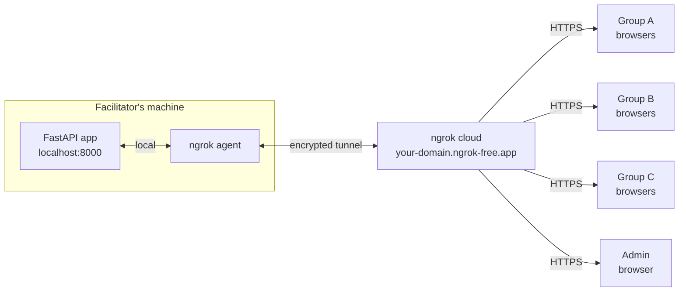
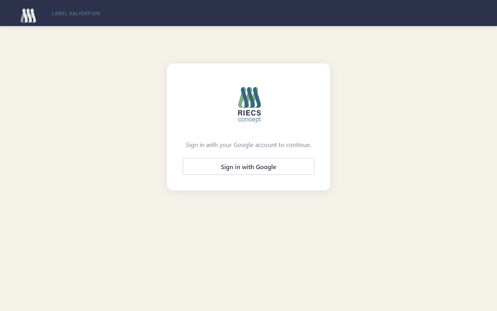
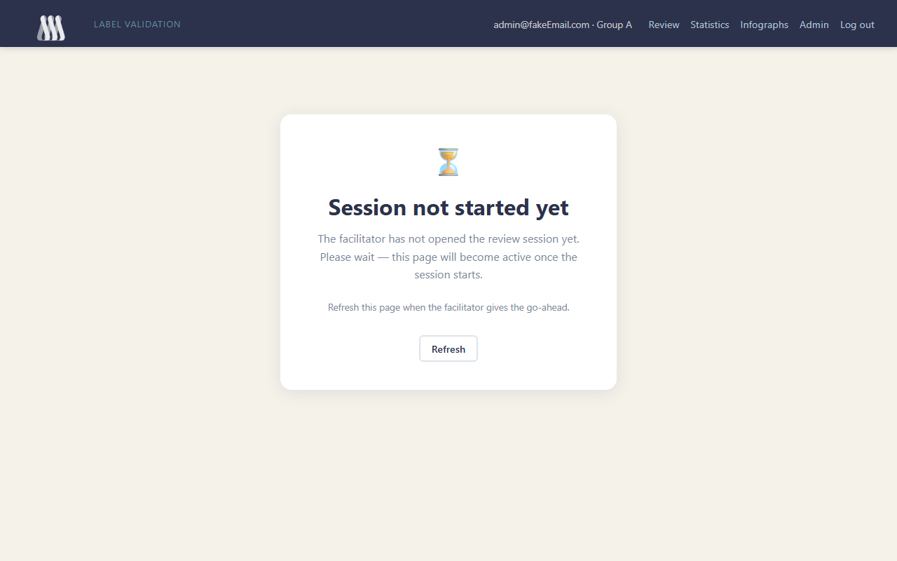
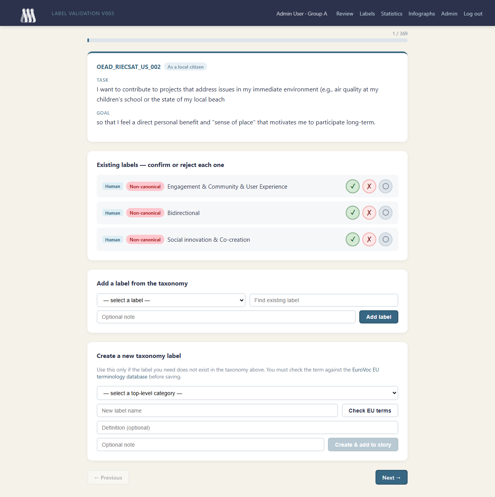
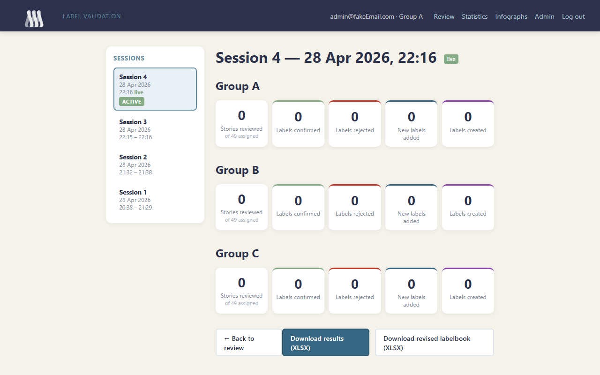
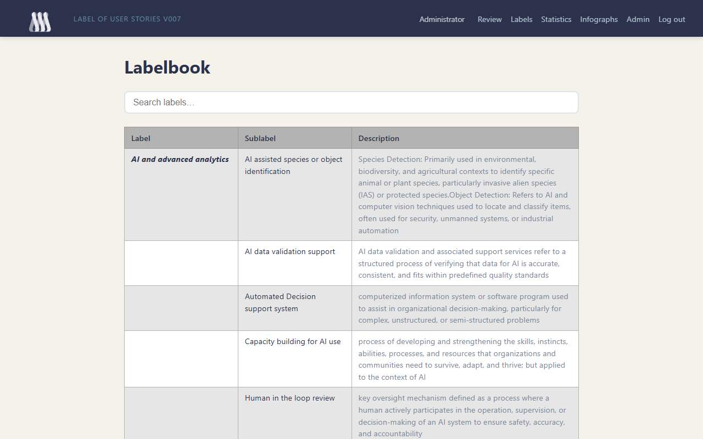
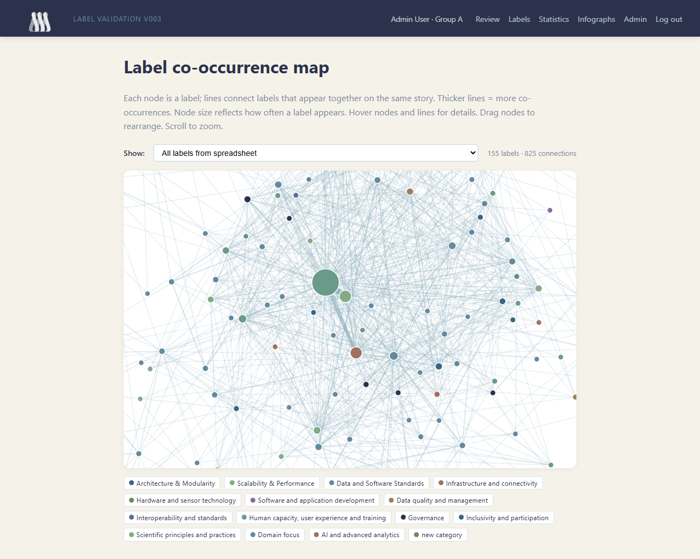
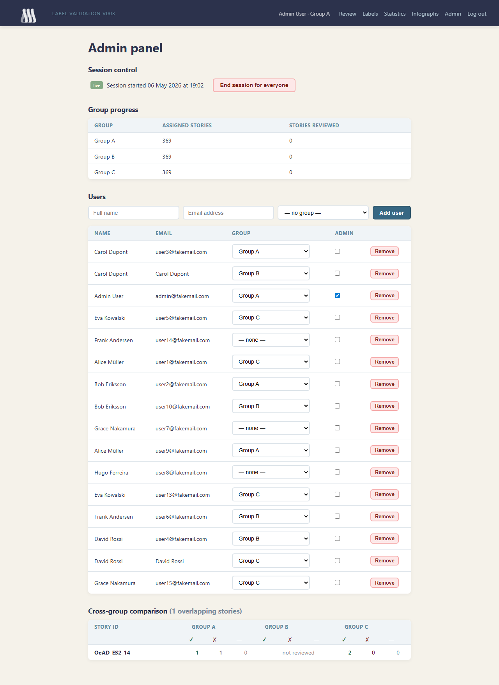

# RIECS Label Validation

A collaborative web application for research groups to validate AI- and human-generated labels on user stories. Designed for use in moderated, time-boxed workshops where multiple groups review the same dataset in parallel and produce a reconciled, annotated Excel export.

Built for the [RIECS](https://riecs.eu) pan-European citizen science research infrastructure project.

---

## Architecture

The facilitator runs the application on their own machine and exposes it to all participants through an **ngrok tunnel**. No server or cloud infrastructure is required beyond a free ngrok account.



All traffic flows through a single HTTPS endpoint. Participants need only a browser and the shared URL — no installation, no accounts beyond Google login.

---

## How it works

### 1. Login

Participants sign in with their Google account. No password or account creation is required — the admin pre-registers participants by email so their group assignment is already in place when they first log in.



---

### 2. Waiting for the session to start

Before the facilitator opens the session, participants who navigate to the review page see a waiting screen. This prevents any reviewing before the session is officially started.



---

### 3. Review stories one by one

Once the session is started, researchers are taken to the review queue. Stories are shown one at a time in the order assigned to their group. A progress bar at the top tracks how far through the queue they have reached.



Each story card shows:
- **Story ID** and metadata (user type, stakeholder group)
- **Task** and **Goal** from the original user story
- **Existing labels** — both Human- and AI-generated — each with icon decision buttons

#### Label quality tags

Every Human-generated label carries a colour-coded **status pill** indicating how closely it maps to the official RIECS labelbook:

| Pill | Meaning |
|---|---|
|  | Label comes from a different taxonomy; no direct equivalent in the labelbook |
|  | Label cell appears split or corrupted across columns |
|  | Label is recognisably close to a labelbook entry |
|  | Label is found verbatim in the labelbook |

Hovering the pill shows a one-sentence definition. AI-generated labels carry no status tag.

#### Decision buttons

Each label row shows three circular icon buttons:

| Button | Action |
|---|---|
| ✓ (green) | Confirm the label |
| ✗ (red) | Reject the label |
| ○ (grey) | Abstain |

Hovering over a label text with a dashed underline shows its taxonomy description as a tooltip.

#### Adding labels from the taxonomy

Below the existing labels, researchers can add further labels from a dropdown that mirrors the full taxonomy hierarchy. An optional note can accompany each addition. Labels added in error can be removed before moving on.

#### Creating new taxonomy labels

If no suitable label exists in the taxonomy, researchers can propose one in the **"Create a new taxonomy label"** section:

1. Select a top-level category from the dropdown (or choose **Other** to create a new category).
2. Type the new label name.
3. Click **Check EU terms** — the system queries the [EuroVoc](https://eurovoc.europa.eu) EU terminology database and shows matching terms with **use this** buttons. Checking is mandatory before the **Create & add to story** button becomes active.
4. Click **Create & add to story**.

Created labels are tracked separately under **"Labels created this session"**, distinct from labels merely added from the existing taxonomy.

---

### 4. Track progress in Statistics

The Statistics page shows a live summary per group for the selected session.



The **session sidebar** lists all past and active sessions. Each session shows the date and time; active sessions are marked **live**, completed ones **ended**.

Five stat cards per group show:

| Card | Meaning |
|---|---|
| Stories reviewed | Distinct stories with at least one decision |
| Labels confirmed | Total confirm decisions |
| Labels rejected | Total reject decisions |
| New labels added | Labels picked from existing taxonomy and added |
| Labels created | Brand-new taxonomy labels proposed and created |

Two download buttons are available:
- **Download results (XLSX)** — annotated spreadsheet for the selected session, colour-coded by decision
- **Download revised labelbook (XLSX)** — the full taxonomy including all user-created labels, ready to carry forward to the next workshop

---

### 5. Browse the labelbook

The Labels page shows the complete taxonomy — both the pre-loaded labelbook and any labels proposed during sessions.



A search box at the top filters the table in real time as you type. User-created labels are sorted to the top and marked with a yellow **new** tag.

Each row shows:

| Column | Content |
|---|---|
| **Label** (25%) | Top-level category — bold italic, shown only on the first row of each group |
| **Sublabel** (25%) | The specific label name |
| **Description** (50%) | Definition from the labelbook or entered when creating the label |

---

### 6. Explore the label co-occurrence map

The Infographs page shows a force-directed network of all labels in the dataset.



- **Nodes** represent labels; size reflects frequency across stories
- **Edges** connect labels that appear on the same story; thickness reflects co-occurrence count
- **Node colour** indicates the taxonomy top-level category (legend shown below the graph)
- **Hover a node** to see its name, category, and story count
- **Hover an edge** to see the two labels it connects and their co-occurrence count
- **Drag nodes** to rearrange; scroll to zoom
- Toggle between **All labels** and **Confirmed labels only** using the dropdown

---

### 6. Admin panel

Administrators have access to the Admin panel.



#### Session control

The facilitator starts and ends the session for all groups from here. While a session is live, all participants can review. When ended, the waiting screen is shown until a new session is started.

#### Group progress

A table shows, per group, how many stories have been reviewed in the **current** session (not a lifetime total).

#### Users

Pre-register participants before the workshop by entering their name, email address, and group. When they log in with Google for the first time, their group assignment is already in place.

Existing users can be reassigned to different groups or promoted to admin via the same table. Users can also be removed.

#### Cross-group comparison

When the same story has been reviewed by more than one group, a comparison table shows each group's confirm / reject / abstain counts side by side — useful for spotting disagreements during the post-session discussion.

---

## Getting started

### Requirements

- Python 3.11+
- A Google Cloud project with OAuth 2.0 credentials ([guide](https://developers.google.com/identity/protocols/oauth2))
- An [ngrok](https://ngrok.com) account (free tier is sufficient) with a static domain

### Installation

```bash
git clone https://github.com/dcuartielles/riecs-label-validation.git
cd riecs-label-validation
python -m venv .venv
source .venv/bin/activate        # Windows: .venv\Scripts\activate
pip install -r requirements.txt
```

### Configuration

Create a `.env` file in the project root:

```env
GOOGLE_CLIENT_ID=your-google-client-id
GOOGLE_CLIENT_SECRET=your-google-client-secret
SECRET_KEY=a-long-random-string
DATABASE_URL=sqlite+aiosqlite:///./labelling.db
BASE_URL=https://your-domain.ngrok-free.app
```

In your Google Cloud Console, add `https://your-domain.ngrok-free.app/auth/google/callback` as an **Authorised redirect URI**.

### Import data

Place the stories spreadsheet in `input_data/` and the taxonomy file in `labelbook/`, then run:

```bash
python -m scripts.import_data
```

The script auto-detects the highest-versioned file in `input_data/`, so dropping in a new spreadsheet is all that is needed before re-running.

| Command | Effect |
|---|---|
| `python -m scripts.import_data` | Import if the database is empty; skip if data already exists |
| `python -m scripts.import_data --reset` | Wipe stories, groups, and decisions; **keep** labels proposed during sessions |
| `python -m scripts.import_data --reset --reset-labels` | Wipe everything including all taxonomy labels — use this when replacing the labelbook entirely |

Human label quality status is read from the interleaved `Human label N Status` columns and stored per label — status values are never imported as labels themselves.

### Create the first admin

```bash
python -m scripts.create_admin your@email.com
```

This can be run before the first login — the account will be linked to your Google identity when you sign in.

### Pre-register participants (optional but recommended)

Log in as admin, open the **Admin panel**, and use the **Add user** form to enter each participant's name, email, and group. They will land in the correct group the moment they log in — no waiting for the admin to assign them during the session.

### Run the application

```bash
python run.py
```

The app starts on `http://localhost:8000`. In a second terminal, expose it via ngrok:

```bash
ngrok http --domain=your-domain.ngrok-free.app 8000
```

Share the ngrok URL with participants. Start the session from the Admin panel when everyone is ready.

---

## Facilitator checklist

- [ ] Import data (`python -m scripts.import_data`)
- [ ] Create admin account (`python -m scripts.create_admin your@email.com`)
- [ ] Start the app (`python run.py`) and the ngrok tunnel
- [ ] Pre-register participants in the Admin panel
- [ ] Share the ngrok URL
- [ ] Click **Start session** when ready to begin
- [ ] Monitor progress on the Admin panel and Stats page
- [ ] Click **End session** when time is up
- [ ] Download results from the Stats page

---

## Project structure

```
app/
  routers/        FastAPI route handlers
    auth.py         Google OAuth login/logout
    review.py       Story review, label decisions, EuroVoc lookup
    stats.py        Session statistics
    admin.py        Session control, user and group management
    export.py       XLSX export (results + revised labelbook)
    infograph.py    Force-directed label co-occurrence graph
  templates/      Jinja2 HTML templates
  static/         CSS, favicon, images
  models.py       SQLAlchemy ORM models
  auth.py         OAuth helpers and session management
  database.py     Async SQLAlchemy engine + DB initialisation
scripts/
  import_data.py      Load stories, taxonomy, and group assignments
  create_admin.py     Create or promote a user to admin
  take_screenshots.py Automated README screenshot capture
labelbook/        Taxonomy spreadsheet
input_data/       Source stories spreadsheet (git-ignored)
docs/             Screenshots and supplementary materials
```

---

## Tech stack

| Layer | Technology |
|---|---|
| Backend | [FastAPI](https://fastapi.tiangolo.com) + [uvicorn](https://www.uvicorn.org) |
| Database | SQLite via [SQLAlchemy](https://www.sqlalchemy.org) (async / aiosqlite) |
| Auth | Google OAuth 2.0 via [Authlib](https://docs.authlib.org) |
| Templates | [Jinja2](https://jinja.palletsprojects.com) (server-rendered) |
| Export | [openpyxl](https://openpyxl.readthedocs.io) |
| Visualisation | [D3.js](https://d3js.org) v7 (force-directed graph) |
| Terminology | [EuroVoc](https://eurovoc.europa.eu) via EU Publications Office SPARQL endpoint |
| Tunnel | [ngrok](https://ngrok.com) |

---

## License

This project is licensed under the **GNU General Public License v3.0**.  
See [LICENSE](LICENSE) for the full text.

Developed as part of the [RIECS](https://riecs.eu) pan-European citizen science research infrastructure project.
